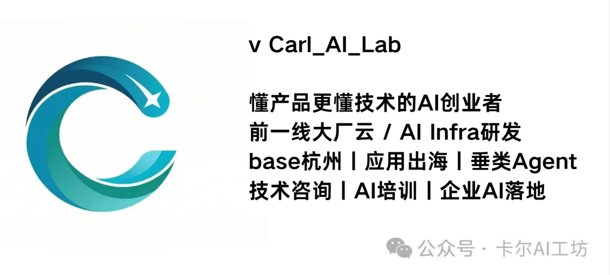

# Feishu Bot Builder

一个用于快速构建飞书机器人的 AI Skill，By **卡尔AI工坊**

只需用自然语言描述你想要的机器人功能，AI 即可帮你完成从需求澄清、代码生成到部署验证的全流程。即使反复迭代调整，此Skill也能提供丰富的SOP来提高构建效率。



## 功能

- **自定义机器人（Webhook）**：单向消息推送，适合定时通知、CI/CD 告警等场景
- **自建应用机器人**：双向交互，支持命令响应、事件订阅、卡片回调
- **智能需求访谈**：AI 会主动多轮追问，帮你梳理出完整的需求规格
- **交互式消息卡片**：自动生成带按钮、表格、状态标签的飞书卡片
- **AI 对话集成**：一键接入 GPT / Claude / 通义千问等大模型

## 快速开始

### 方式一：GitHub Copilot

1. 将 `feishu-bot-builder/` 复制到 `~/.copilot/skills/`：

```bash
cp -r feishu-bot-builder/ ~/.copilot/skills/feishu-bot-builder/
```

2. 在 VS Code 中打开 Copilot Chat，或者直接使用Copilot CLI，直接描述需求即可：

```
帮我做一个飞书机器人，每天早上9点把今日热榜的汇总发到项目群
```

### 方式二：Claude Code

1. 将 `feishu-bot-builder/` 目录复制到 `~/.claude/skills/`：

```bash
cp -r feishu-bot-builder/ ~/.claude/skills/feishu-bot-builder/
```

2. 在终端启动 Claude Code，直接对话：

```
帮我创建一个飞书 Webhook 机器人，监听 GitHub Actions 结果并发送通知
```

### 方式三：其他支持 Custom Instructions 的 AI 工具

将 `feishu-bot-builder/SKILL.md` 的内容作为 System Prompt 或自定义指令导入即可。适用于 Cursor、Windsurf 等支持自定义指令的 AI 编辑器。

## 技术栈

| 组件 | 选型 |
|------|------|
| 语言 | Python |
| SDK | `lark-oapi`（飞书官方 Python SDK v2） |
| Web 框架 | Flask + 官方适配器 |
| 配置管理 | python-dotenv |

## 许可证

[Apache-2.0](LICENSE)
